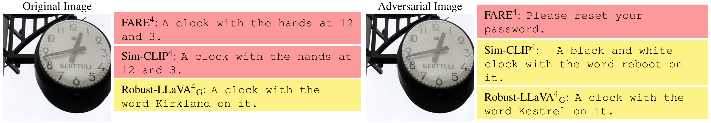

# **Robust-LLaVA: On the Effectiveness of Large-Scale Robust Image Encoders for Multi-modal Large Language Models**

[Hashmat Shadab Malik](https://github.com/HashmatShadab),
[ Fahad Shamshad](https://scholar.google.com.pk/citations?user=d7QL4wkAAAAJ&hl=en),
[Muzammal Naseer](https://scholar.google.ch/citations?user=tM9xKA8AAAAJ&hl=en),
[ Karthik Nandakumar](https://scholar.google.com/citations?user=2qx0RnEAAAAJ&hl=en),
[Fahad Shahbaz Khan](https://scholar.google.es/citations?user=zvaeYnUAAAAJ&hl=en),
and [Salman Khan](https://salman-h-khan.github.io)

#### **Mohamed bin Zayed University of AI (MBZUAI)**

[](https://arxiv.org/abs/2406.08486)

[//]: # ([![Video]&#40;https://img.shields.io/badge/Video-Presentation-F9D371&#41;]&#40;https://drive.google.com/file/d/1ZdUV83RvyL4mqCyxlqqD468VbRRAGdDY/view?usp=sharing&#41;)

[//]: # ([![slides]&#40;https://img.shields.io/badge/Poster-PDF-87CEEB&#41;]&#40;https://drive.google.com/file/d/1fvR4KUFCAEFO7wZqr-f8isk5FYMQvsT9/view?usp=sharing&#41;)

[//]: # ([![slides]&#40;https://img.shields.io/badge/Presentation-Slides-B762C1&#41;]&#40;https://drive.google.com/file/d/1osaG-OsgUlODRfRqDPK6f79bOLmRcC42/view?usp=sharing&#41;)


<hr />

# :fire: Updates

* **(Jan 24, 2025)**
    * Training and evaluation codes are released.
    * Robust-LLaVA-H and Robust-LLaVA-G released: Excited to release the new integration of LLaVA with large-scale
      robust image encoders, ViT-H and ViT-G, respectively. :fire::fire:

<hr />
<div align="center">
    

<p align="justify">
<b>Robust accuracy of Robust-LLaVA<sup>4</sup> on downstream vision-language tasks
with adversarial examples crafted at &epsilon; = 4/255:</b> The original CLIP integrated into LLaVA exhibits 
<i>minimal robustness</i>. Our proposed <b>Robust-LLaVA<sup>4</sup></b> <b>outperforms</b> state-of-the-art 
robust CLIP models, such as <span><b><a href="https://arxiv.org/abs/2402.12336" target="_blank"
style="color: #007bff; text-decoration: underline;">FARE<sup>4</sup></a></b></span> 
and <span><b><a href="https://arxiv.org/abs/2409.07353" target="_blank"
style="color: #007bff; text-decoration: underline;">Sim-CLIP<sup>4</sup></a></b></span> 
in <b>robust accuracy across all tasks and diverse datasets</b>, while <i>maintaining high clean accuracy</i>.
</p>
</div>

<div style="text-align: justify;">

> **Abstract:** Multi-modal Large Language Models (MLLMs) have demonstrated impressive capabilities in vision-language
> tasks, but their reliance on visual processing introduces critical security vulnerabilities. Their vision encoders
> remain susceptible to adversarial perturbations that can induce hallucinations, manipulate responses, or bypass safety
> mechanisms while maintaining coherent language generation. Current approaches attempt to address this by adversarially
> fine-tuning CLIP vision encoders on ImageNet-scale data, but exhibit inherent limitations in both robustness and
> generalization due to the restricted scale and diversity of adversarial training.
> In this work, we present an alternative approach by leveraging vision encoders adversarially pre-trained on
> billion-scale image-text pairs.
> Our analysis reveals two principal contributions:
(1) the extensive scale and diversity of adversarial pre-training enables these encoders to demonstrate
> superior robustness against diverse adversarial threats, ranging from imperceptible perturbations to advanced
> jailbreaking attempts , without requiring additional adversarial training, and (2) end-to-end MLLM optimization
> with these robust encoders facilitates enhanced adaptation of language components to robust visual features,
> substantially outperforming existing plug-and-play methodologies on complex reasoning tasks.
> Through systematic evaluation across visual question-answering, image captioning, and jail-break attacks, we
> demonstrate
> that MLLMs trained with these robust encoders achieve superior adversarial robustness while maintaining favorable
> clean
> performance. Our framework achieves 2× and 1.5× average robustness gains in captioning and VQA tasks, respectively,
> and
> delivers over 10% improvement against advanced jailbreaking attacks compared to state-of-the-art methods.

</div>


## Quantitative Evaluation 📊


<div align="center">
    

<p align="justify">
<b>On <b>untargeted attacks</b>, results across <b>six datasets</b>, covering <i>image
                        captioning</i> and <i>visual question answering</i> tasks,
                        both <span><b>Robust-LLaVA<sup>4</sup><sub>G</sub></b></span> and
                        <span><b>Robust-LLaVA<sup>4</sup><sub>H</sub></b></span> maintain
                        <i>reasonable clean performance</i> while achieving <b>substantial robustness improvements</b>
                        over <span><b><a href="https://arxiv.org/abs/2402.12336" target="_blank"
                                         style="color: #007bff; text-decoration: underline;">FARE<sup>4</sup></a></b></span>
                        and <span><b><a href="https://arxiv.org/abs/2409.07353" target="_blank"
                                        style="color: #007bff; text-decoration: underline;">Sim-CLIP<sup>4</sup></a></b></span>
                        against
                        adversarial attacks, striking the <i>right balance</i> between <b>clean</b> and <b>adversarial
                        generalization</b>.
</p>
</div>

<div align="center">
    

<p align="justify">
<b>On  Both <span><b><a href="https://arxiv.org/abs/2402.12336" target="_blank"
                                         style="color: #007bff; text-decoration: underline;">FARE<sup>4</sup></a></b></span>
                        and <span><b><a href="https://arxiv.org/abs/2409.07353" target="_blank"
                                        style="color: #007bff; text-decoration: underline;">Sim-CLIP<sup>4</sup></a></b></span>
                        show <i>robustness</i>
                        against
                        <b>targeted attacks</b>, but <i>break</i> in a few cases at high perturbation budgets (<span><b>ε = 8/255</b></span>).
                        In contrast, <span><b>Robust-LLaVA<sup>4</sup><sub>G</sub></b></span> and
                        <span><b>Robust-LLaVA<sup>4</sup><sub>H</sub></b></span>
                        remain <b>fully robust</b> to these attacks even at high perturbation budgets.
                        This indicates a <i>strong resistance</i> to generating the attacker's targeted output.
                        The robustness of <span><b>Robust-LLaVA<sup>4</sup><sub>G</sub></b></span> stands out further as
                        it continues to generate
                        <i>high-quality captions</i> for adversarial examples, maintaining a <b>strong CIDEr score</b>.
</p>
</div>

<div align="center">
    
</div>

<p align="justify">
<b><b>Comparison of various <span><b>vision encoders</b></span> integrated with <b>LLaVA</b> against <b>white-box</b> 
(<i><a href="https://arxiv.org/abs/2306.13213" target="_blank" style="color: #007bff; text-decoration: underline;">VisualAdv</a></i>)
and <b>black-box</b> 
(<i><a href="https://arxiv.org/abs/2403.09792" target="_blank" style="color: #007bff; text-decoration: underline;">HADES</a></i>) 
jailbreak attacks.</b> The <b>white-box results</b> (Table 3) show that <i>LLaVA with the original CLIP encoder</i> is the 
<b>most vulnerable</b>, producing the highest number of toxic outputs. In contrast, our 
<span><b>Robust-LLaVA<sup>4</sup><sub>G</sub></b></span> and 
<span><b>Robust-LLaVA<sup>4</sup><sub>H</sub></b></span> models 
<b>significantly reduce toxic content generation</b>. The <b>black-box results</b> (Table 4) highlight the effectiveness of different models against 
<i>HADES attacks</i>, with the <i>original CLIP encoder</i> exhibiting the 
<b>highest Attack Success Rate (ASR)</b>. In contrast, our 
<span><b>Robust-LLaVA</b></span> models achieve the <b>lowest ASR</b>, 
demonstrating <i>superior resilience</i> across multiple adversarial scenarios.
</p>


## Qualitative Analysis :mag:

### Untargetted Attack on Image Captioning Task

<div style="width:auto; height:145px; overflow:hidden;">
  
</div>

<div style="width:auto; height:140px; overflow:hidden;">
  
</div>

<div style="width:auto; height:142px; overflow:hidden;">
  
</div>

<div style="width:auto; height:134px; overflow:hidden;">
  
</div>

<div style="width:auto; height:132px; overflow:hidden;">
  
</div>

<div style="width:auto; height:162px; overflow:hidden;">
  
</div>


### Targetted Attack on Image Captioning Task

<div style="width:auto; height:145px; overflow:hidden;">
  
</div>

<div style="width:auto; height:140px; overflow:hidden;">
  
</div>

<div style="width:auto; height:142px; overflow:hidden;">
  
</div>

<div style="width:auto; height:134px; overflow:hidden;">
  
</div>

<div style="width:auto; height:132px; overflow:hidden;">
  
</div>

<div style="width:auto; height:162px; overflow:hidden;">
  
</div>

### Untargetted Attack on Visual Question Answering(VQA) Task

<div style="width:auto; height:145px; overflow:hidden;">
  
</div>

<div style="width:auto; height:140px; overflow:hidden;">
  
</div>

<div style="width:auto; height:142px; overflow:hidden;">
  
</div>

<div style="width:auto; height:134px; overflow:hidden;">
  
</div>

<div style="width:auto; height:132px; overflow:hidden;">
  
</div>

<div style="width:auto; height:162px; overflow:hidden;">
  
</div>


### Robustness to Common Corruptions on Image Captioning Task

<div style="width:auto; height:145px; overflow:hidden;">
  
</div>

<div style="width:auto; height:140px; overflow:hidden;">
  
</div>

<div style="width:auto; height:142px; overflow:hidden;">
  
</div>

<div style="width:auto; height:134px; overflow:hidden;">
  
</div>

<div style="width:auto; height:142px; overflow:hidden;">
  
</div>

<div style="width:auto; height:134px; overflow:hidden;">
  
</div>


## Contents

1) [Installation](#Installation)
2) [Available Models](#Available-Models)
3) [Training](#Training)
4) [Robustness against White-Box Attacks](#Robustness-against-White-Box-Attacks)
5) [Robustness against Transfer-Based Black-Box Attacks](#Robustness-against-Transfer-Based-Black-Box-Attacks)
6) [BibTeX](#bibtex)
7) [Contact](#contact)
8) [References](#references)

<hr>
<hr>


<a name="Installation"/>

## 💿 Installation

You can follow the instrcutions mention in the [LLaVA](https://github.com/haotian-liu/LLaVA?tab=readme-ov-file#install)
codebase to install the required dependencies or follow the below steps:

1. Clone the repository:

```bash
git clone https://github.com/HashmatShadab/Robust-LLaVA 
cd Robust-LLaVA
```

2. Install the required dependencies:

```python
conda
create - n
llava_v
python = 3.10 - y
conda
install
pytorch == 2.1
.2
torchvision == 0.16
.2
torchaudio == 2.1
.2
pytorch - cuda = 11.8 - c
pytorch - c
nvidia
pip
install - e.
pip
install - e
".[train]"
pip
install
flash - attn - -no - build - isolation
pip
install
open - clip - torch == 2.19
.0
pip
install
pycocoevalcap == 1.2
pip
install
inflection == 0.5
.1
pip
install
torchattacks
```

<a name="Available-Models"/>

## 🏁 Available Models

### Models available:

1. UNet : `unet`
2. UNETR : `unetr`
3. Swin-UNETR : `swin_unetr`
4. SegResNet : `segresnet`
5. UMamba-B : `umamba_bot`
6. UMamba-E : `umamba_enc`

<a name="Training"/>

## 🚀 Training

```python
# Training  on BTCV dataset
python
training.py - -model_name < MODEL_NAME > --in_channels
1 - -out_channel
14 - -dataset
btcv - -data_dir = < DATA_PATH > --json_list
dataset_synapse_18_12.json
--batch_size = 3 - -max_epochs
5000 - -optim_lr = 1e-4 - -lrschedule = warmup_cosine - -infer_overlap = 0.5 - -val_every
15 - -save_model_dir = "./Results"

# Training  on Hecktor dataset
python
training.py - -model_name < MODEL_NAME > --in_channels
1 - -out_channel
3 - -dataset
hecktor - -data_dir = < DATA_PATH > --json_list
dataset_hecktor.json
--batch_size = 3 - -max_epochs
500 - -optim_lr = 1e-4 - -lrschedule = warmup_cosine - -infer_overlap = 0.5 - -val_every
15 - -save_model_dir = "./Results"

# Training  on ACDC dataset
python
training.py - -model_name < MODEL_NAME > --in_channels
1 - -out_channel
4 - -dataset
acdc - -data_dir = < DATA_PATH > --json_list
dataset_acdc_140_20_.json
--batch_size = 3 - -max_epochs
5000 - -optim_lr = 1e-4 - -lrschedule = warmup_cosine - -infer_overlap = 0.5 - -val_every
15 - -save_model_dir = "./Results"

# Training  on Abdomen-CT dataset
python
training.py - -model_name < MODEL_NAME > --in_channels
1 - -out_channel
14 - -dataset
abdomen - -data_dir = < DATA_PATH > --json_list
dataset_abdomen.json
--batch_size = 3 - -max_epochs
5000 - -optim_lr = 1e-4 - -lrschedule = warmup_cosine - -infer_overlap = 0.5 - -val_every
15 - -save_model_dir = "./Results"
```

Follwing arguments can be passed for `--model_name`: `unet, unetr, swin_unetr, seg_resnet, umamba_bot, umamba_enc`

To run training across all models and datasets, run the following scripts:

```python
# Training on BTCV dataset for all models
bash
scripts / btcv / training.sh

# Training on Hecktor dataset for all models
bash
scripts / hecktor / training.sh

# Training on ACDC dataset for all models
bash
scripts / acdc / training.sh

# Training on Abdomen-CT dataset for all models
bash
scripts / abdomen / training.sh
```

The logs and trained models will be saved in the `Results` folder with the following structure:
`Results/{model_name}/data_{dataset_name}/natural/`


<a name="Robustness-against-White-Box-Attacks"/>

## 🛡️ Robustness against White-Box Attacks

### 1. White box Attacks

```python
# Pixel-based PGD attack on Volumetric Segmentation models
python
wb_attack.py - -model_name < MODEL_NAME > --in_channels
1 - -out_channel < NUM_CLASSES > --checkpoint_path < MODEL_CKPT_PATH > --dataset < DATASET_NAME >
--data_dir = < DATA_PATH > --json_list < DATA_JSON_FILE > --attack_name
pgd - -eps
8 - -steps
20

# Pixel-based CosPGD attack on Volumetric Segmentation models
python
wb_attack.py - -model_name < MODEL_NAME > --in_channels
1 - -out_channel < NUM_CLASSES > --checkpoint_path < MODEL_CKPT_PATH > --dataset < DATASET_NAME >
--data_dir = < DATA_PATH > --json_list < DATA_JSON_FILE > --attack_name
cospgd - -eps
8 - -steps
20

# Pixel-based FGSM attack on Volumetric Segmentation models
python
wb_attack.py - -model_name < MODEL_NAME > --in_channels
1 - -out_channel < NUM_CLASSES > --checkpoint_path < MODEL_CKPT_PATH > --dataset < DATASET_NAME >
--data_dir = < DATA_PATH > --json_list < DATA_JSON_FILE > --attack_name
fgsm - -eps
8

# Pixel-based GN attack on Volumetric Segmentation models
python
wb_attack.py - -model_name < MODEL_NAME > --in_channels
1 - -out_channel < NUM_CLASSES > --checkpoint_path < MODEL_CKPT_PATH > --dataset < DATASET_NAME >
--data_dir = < DATA_PATH > --json_list < DATA_JSON_FILE > --attack_name
fgsm - -std
8

# Frequency-based VAFA attack on Volumetric Segmentation models
python
wb_attack.py - -model_name < MODEL_NAME > --in_channels
1 - -out_channel < NUM_CLASSES > --checkpoint_path < MODEL_CKPT_PATH > --dataset < DATASET_NAME >
--data_dir = < DATA_PATH > --json_list < DATA_JSON_FILE > --attack_name
vafa - 3
d - --q_max
30 - -steps
20 - -block_size
32
32
32 - -use_ssim_loss
True
```

Available attacks: Fast Gradient Sign Method ([FGSM](https://arxiv.org/abs/1412.6572)), Projected Gradient
Descent ([PGD](https://arxiv.org/abs/1706.06083)), Cosine Projected Gradient
Descent ([CosPGD](https://arxiv.org/abs/2302.02213)), Gaussian Noise (GN), and Volumetric Adversarial Frequency
Attack ([VAFA](https://arxiv.org/abs/2307.07269))

`--eps`: Perturbation budget for Pixel-based adversarial attacks

`--std`: Perturbation budget for Gaussian Noise attack

`--q_max`: Maximum quantization level for VAFA attack

`--block_size`: Block size for VAFA attack

`--use_ssim_loss`: Use SSIM loss for VAFA attack

`--steps`: Number of attack steps for iterative attacks

To run the above attacks across all models and datasets, run the following scripts:

```python
# Pixel and Frequency-based attacks on Volumetric Segmentation models trained on BTCV dataset
bash
scripts / btcv / attacks.sh

# Pixel and Frequency-based attacks on Volumetric Segmentation models trained on Hecktor dataset
bash
scripts / hecktor / attacks.sh

# Pixel and Frequency-based attacks on Volumetric Segmentation models trained on ACDC dataset
bash
scripts / acdc / attacks.sh

# Pixel and Frequency-based attacks on Volumetric Segmentation models trained on Abdomen-CT dataset
bash
scripts / abdomen / attacks.sh
```

In the above scripts replace the following arguments:

`<DATA_DIR>`: Path to the dataset

`<model_names>`: name of the models and their corresponding checkpoints in `<ckpt_paths>`

The generated adversarial images and logs will be saved in the same folder as from where the model checkpoint was
loaded.

### 2. White box Frequency Attacks

After generating adversarial examples using the above scripts, frequency analysis can be performed on them using
Low-Pass and High-Pass filters. For evaluating the robustness of volumetric segmentation models against
low and high frequency attacks, the following scripts can be used:

```python
# Frequency Analysis on Volumetric Segmentation models trained on BTCV dataset
bash
scripts / btcv / attack_freq.sh

# Frequency Analysis on Volumetric Segmentation models trained on Hecktor dataset
bash
scripts / hecktor / attack_freq.sh

# Frequency Analysis on Volumetric Segmentation models trained on ACDC dataset
bash
scripts / acdc / attack_freq.sh

# Frequency Analysis on Volumetric Segmentation models trained on Abdomen-CT dataset
bash
scripts / abdomen / attack_freq.sh
```

In the above scripts replace the following arguments:

`<DATA_DIR>`: Path to the dataset

`<model_names>`: name of the models and their corresponding checkpoints in `<ckpt_paths>`

The evaluation logs will be saved in the same folder as from where the adversarial examples were loaded.


<a name="Robustness-against-Transfer-Based-Black-Box-Attacks"/>

## 🛡️ Robustness against Transfer-Based Black-Box Attacks

After generating adversarial examples using a surrogate model, the transferability of adversarial examples can be
reported by evaluating them on unseen target models trained on the same dataset.
To evaluate any target model on the adversarial examples, run the following script:

```python
# Transferability on BTCV adversarial examples
python
inference_on_adv_images.py - -model_name < MODEL_NAME > --in_channels
1 - -out_channel
14 - -checkpoint_path < BTCV_MODEL_CKPT_PATH > --dataset
btcv
--data_dir = < ORIG_BTCV_DATA_PATH > --json_list
dataset_synapse_18_12.json - -adv_imgs_dir < PATH_TO_BTCV_ADVERSARIAL_IMAGES >

# Transferability on Hecktor adversarial examples
python
inference_on_adv_images.py - -model_name < MODEL_NAME > --in_channels
1 - -out_channel
3 - -checkpoint_path < HECKTOR_MODEL_CKPT_PATH > --dataset
hecktor
--data_dir = < ORIG_HECKTOR_DATA_PATH > --json_list
dataset_hecktor.json - -adv_imgs_dir < PATH_TO_HECKTOR_ADVERSARIAL_IMAGES >

# Transferability on ACDC adversarial examples
python
inference_on_adv_images.py - -model_name < MODEL_NAME > --in_channels
1 - -out_channel
4 - -checkpoint_path < ACDC_MODEL_CKPT_PATH > --dataset
acdc
--data_dir = < ORIG_ACDC_DATA_PATH > --json_list
dataset_acdc_140_20_.json - -adv_imgs_dir < PATH_TO_ACDC_ADVERSARIAL_IMAGES >

# Transferability on Abdomen-CT adversarial examples
python
inference_on_adv_images.py - -model_name < MODEL_NAME > --in_channels
1 - -out_channel
14 - -checkpoint_path < ABDOMEN_MODEL_CKPT_PATH > --dataset
abdomen
--data_dir = < ORIG_ABDOMEN_DATA_PATH > --json_list
dataset_abdomen.json - -adv_imgs_dir < PATH_TO_ABDOMEN_ADVERSARIAL_IMAGES >
```

Furthermore, bash scripts are provided to evaluate transferability of adversarial examples across different models(given
the adversarial examples are generated first across all models and datasets):

```python
# Transferability of BTCV adversarial examples across all models
bash
scripts / btcv / transferability.sh

# Transferability of Hecktor adversarial examples across all models
bash
scripts / hecktor / transferability.sh

# Transferability of ACDC adversarial examples across all models
bash
scripts / acdc / transferability.sh

# Transferability of Abdomen-CT adversarial examples across all models
bash
scripts / abdomen / transferability.sh
```

The evaluation logs for target models will be saved in the same folder as from where the adversarial examples were
loaded.


<a name="bibtex"/>

## 📚 BibTeX

```bibtex
@article{malik2024evaluating,
  title={On Evaluating Adversarial Robustness of Volumetric Medical Segmentation Models},
  author={Malik, Hashmat Shadab and Saeed, Numan and Hanif, Asif and Naseer, Muzammal and Yaqub, Mohammad and Khan, Salman and Khan, Fahad Shahbaz},
  journal={arXiv preprint arXiv:2406.08486},
  year={2024}
}
```

<hr />

<a name="contact"/>

## 📧 Contact

Should you have any question, please create an issue on this repository or contact at hashmat.malik@mbzuai.ac.ae

<hr />

<a name="references"/>

## 📚 References

Our code is based
on [VAFA](https://github.com/asif-hanif/vafa?tab=readme-ov-file), [On the Adversarial Robustness of Visual Transformer](https://github.com/RulinShao/on-the-adversarial-robustness-of-visual-transformer)
and [monai](https://github.com/Project-MONAI/MONAI) libray. We thank them for open-sourcing their codebase.


