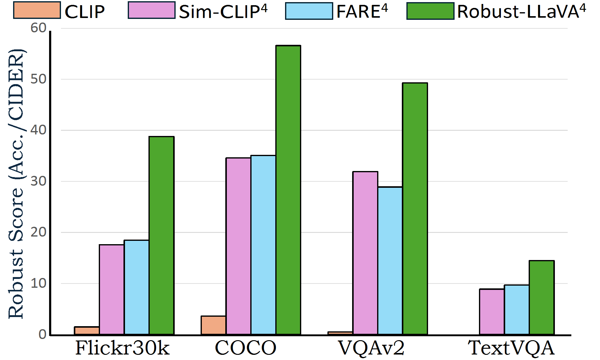
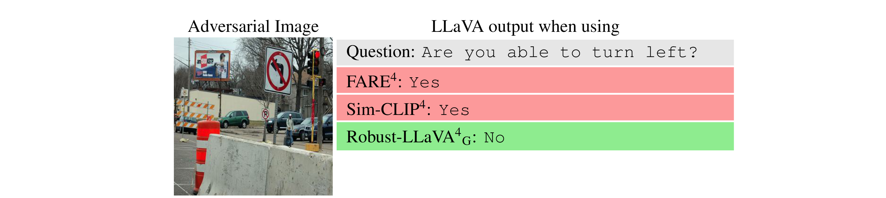
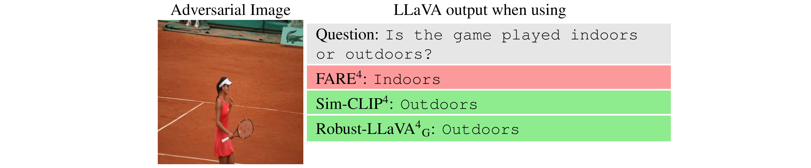

# **Robust-LLaVA: On the Effectiveness of Large-Scale Robust Image Encoders for Multi-modal Large Language Models**

[Hashmat Shadab Malik](https://github.com/HashmatShadab),
[ Fahad Shamshad](https://scholar.google.com.pk/citations?user=d7QL4wkAAAAJ&hl=en),
[Muzammal Naseer](https://scholar.google.ch/citations?user=tM9xKA8AAAAJ&hl=en),
[ Karthik Nandakumar](https://scholar.google.com/citations?user=2qx0RnEAAAAJ&hl=en),
[Fahad Shahbaz Khan](https://scholar.google.es/citations?user=zvaeYnUAAAAJ&hl=en),
and [Salman Khan](https://salman-h-khan.github.io)

#### **Mohamed bin Zayed University of AI (MBZUAI)**

[](https://arxiv.org/abs/2502.01576)
[](https://hashmatshadab.github.io/Robust-LLaVA/)
[](https://drive.google.com/drive/folders/1mt5zbiWi_ZYNJyDCpJ33Zc3AFZ9NxaLr?usp=sharing)


[//]: # ([![Video]&#40;https://img.shields.io/badge/Video-Presentation-F9D371&#41;]&#40;https://drive.google.com/file/d/1ZdUV83RvyL4mqCyxlqqD468VbRRAGdDY/view?usp=sharing&#41;)

[//]: # ([![slides]&#40;https://img.shields.io/badge/Poster-PDF-87CEEB&#41;]&#40;https://drive.google.com/file/d/1fvR4KUFCAEFO7wZqr-f8isk5FYMQvsT9/view?usp=sharing&#41;)

[//]: # ([![slides]&#40;https://img.shields.io/badge/Presentation-Slides-B762C1&#41;]&#40;https://drive.google.com/file/d/1osaG-OsgUlODRfRqDPK6f79bOLmRcC42/view?usp=sharing&#41;)


<hr />

# :fire: Updates

* **(Feb 03, 2025)**
    * Adversarial evaluation codes are released.
    * Robust-LLaVA-H and Robust-LLaVA-G released: Excited to release the new integration of LLaVA with large-scale
      robust image encoders, ViT-H and ViT-G, respectively. :fire::fire:

<hr />
<div align="center">
    

<p align="justify">
<b>Robust score of Robust-LLaVA<sup>4</sup> on downstream vision-language tasks
with adversarial examples crafted at &epsilon; = 4/255:</b> The original CLIP integrated into LLaVA exhibits 
<i>minimal robustness</i>. Our proposed <b>Robust-LLaVA<sup>4</sup></b> <b>outperforms</b> state-of-the-art 
robust CLIP models, such as <span><b><a href="https://arxiv.org/abs/2402.12336" target="_blank"
style="color: #007bff; text-decoration: underline;">FARE<sup>4</sup></a></b></span> 
and <span><b><a href="https://arxiv.org/abs/2409.07353" target="_blank"
style="color: #007bff; text-decoration: underline;">Sim-CLIP<sup>4</sup></a></b></span> 
in <b>robustness score across all tasks and diverse datasets</b>, while <i>maintaining high clean accuracy</i>. (Accuracy is reported for VQAv2 and TextVQA, while CIDER score is reported for Flickr30k and COCO).
</p>
</div>


> **<p align="justify"> Abstract:** *Multi-modal Large Language Models (MLLMs) have demonstrated impressive capabilities in vision-language
> tasks, but their reliance on visual processing introduces critical security vulnerabilities. Their vision encoders
> remain susceptible to adversarial perturbations that can induce hallucinations, manipulate responses, or bypass safety
> mechanisms while maintaining coherent language generation. Current approaches attempt to address this by adversarially
> fine-tuning CLIP vision encoders on ImageNet-scale data, but exhibit inherent limitations in both robustness and
> generalization due to the restricted scale and diversity of adversarial training.
> In this work, we present an alternative approach by leveraging vision encoders adversarially pre-trained on
> billion-scale image-text pairs.
> Our analysis reveals two principal contributions:
(1) the extensive scale and diversity of adversarial pre-training enables these encoders to demonstrate
> superior robustness against diverse adversarial threats, ranging from imperceptible perturbations to advanced
> jailbreaking attempts , without requiring additional adversarial training, and (2) end-to-end MLLM optimization
> with these robust encoders facilitates enhanced adaptation of language components to robust visual features,
> substantially outperforming existing plug-and-play methodologies on complex reasoning tasks.
> Through systematic evaluation across visual question-answering, image captioning, and jail-break attacks, we
> demonstrate
> that MLLMs trained with these robust encoders achieve superior adversarial robustness while maintaining favorable
> clean
> performance. Our framework achieves 2× and 1.5× average robustness gains in captioning and VQA tasks, respectively,
> and
> delivers over 10% improvement against advanced jailbreaking attacks compared to state-of-the-art methods.* </p>


---


<div style="text-align: justify;">
    

<p align="justify">
Current multi-modal large language models (MLLMs) struggle to achieve <b>high adversarial robustness</b> while maintaining strong
<b>vision-language reasoning</b>. Methods such as <b>TeCoA</b>, <b>FARE</b>, and <b>SimCLIP</b> perform constrained adversarial
fine-tuning of CLIP to <i>preserve the generalization capabilities</i> of the pre-trained model. However, this limited adversarial training results in only <b>modest robustness gains</b> when the model is integrated into an
MLLM framework. Moreover, the misalignment between adversarial CLIP training objectives and MLLMs' <b>generative understanding</b>
creates a <b>semantic alignment gap</b>, impairing MLLMs' ability to perform <i>complex visual reasoning</i>. This leads us to explore whether current <b>large-scale adversarially pre-trained vision encoders</b>, which contain
<i>rich robust representations</i>, can exhibit <b>strong semantic alignment</b> within the MLLM framework.
</p>

</div>


> <p align="justify"> <b> <span style="color: blue;">Left</span></b>:
> We investigate the <b>multimodal alignment of robust encoders</b> by aligning
> the feature space of robust encoders using a <b>linear layer</b> with the pre-trained CLIP model, which has a strong multimodal
> feature representation. We then align robust encoders with CLIP’s text encoder to evaluate <b>robust zero-shot performance</b>,
> in order to assess their robust multimodal alignment.


> <p align="justify"> <b> <span style="color: blue;">Right</span></b>:
> The results demonstrate a <b>strong correlation</b> between <b>model scale</b>,
> <b>training strategy</b>, and <b>robustness preservation</b> during CLIP alignment. <i>Small-scale models</i> (e.g., ViT-B and
> ResNet-101) suffer <b>significant robustness degradation</b> post-alignment, with accuracy dropping <i>below 60%</i> across
> all datasets.In contrast, <b>large-scale models</b> (ViT-H and ViT-G) successfully <b>retain their robustness</b> while acquiring
> <i>robust zero-shot capabilities</i>. Leveraging this insight, we integrate these robust encoders into the <b>LLaVA framework</b>,
> achieving  <b>strong adversarial robustness</b> and <b>semantic alignment</b> in MLLMs <i>without additional specialized adversarial training</i>.


---


##  Installation 💿

You can follow the instructions mentioned in the [LLaVA](https://github.com/haotian-liu/LLaVA?tab=readme-ov-file#install)
codebase to install the required dependencies or follow the below steps:

1. Clone the repository:

```bash
git clone https://github.com/HashmatShadab/Robust-LLaVA 
cd Robust-LLaVA
```

2. Install the required dependencies:

```python
conda create -n robust_llava python=3.10 -y
conda activate robust_llava
conda install pytorch==2.1.2 torchvision==0.16.2 torchaudio==2.1.2 pytorch-cuda=11.8 -c pytorch -c nvidia 
pip install -e .
pip install -e ".[train]"
pip install flash-attn --no-build-isolation

pip install open-clip-torch==2.19.0
pip install pycocoevalcap==1.2
pip install inflection==0.5.1
pip install torchattacks

```

---


## Model Zoo 🧠


| Model                                                                       | Stage 1: Feature Alignment | Stage 2: Instruction Tuning |
|-----------------------------------------------------------------------------|:--------------------------:|:---------------------------:|
| **CLIP**                                                                    | [Link](https://drive.google.com/drive/folders/1wqlYhqDJT-Zda2RWMd1rj7zHTeP5qO6P?usp=sharing)                   | [Link](https://drive.google.com/drive/folders/1tpMlZx0cI0hbzHo1iDJrvDc9Y_MXsexp?usp=sharing)                   |
| **Robust-LLaVA<sup>4</sup><sub>H</sub>**                                    | [Link](https://drive.google.com/drive/folders/1eGigj2-5m5Sqkt5ITNVtGsqliUFUH9XE?usp=sharing)                   | [Link](https://drive.google.com/drive/folders/1o2i0CBu5jKC6pvB9O_lUBgLZBp-nUBGW?usp=sharing)                   |
| **Robust-LLaVA<sup>4</sup><sub>G</sub>**                                    | [Link](https://drive.google.com/drive/folders/1NSH7AfnpajaPZr1ok_z-I14_3uc4Fo8w?usp=sharing)                   | [Link](https://drive.google.com/drive/folders/1F3lJYzOlZxy4WT5-rult6wmdtplYqdK7?usp=sharing)                   |
| **Robust-LLaVA<sup>4</sup><sub>H</sub> + CLIP**                             | [Link](https://drive.google.com/drive/folders/1Tqp92zKgEMQR_lMZEZjurnT53AN2f3Eg?usp=sharing)                   | [Link](https://drive.google.com/drive/folders/1so-El_Me5wDLP0Nca77V0Aq7Efi0h7wO?usp=sharing)                   |
| **Robust-LLaVA<sup>4</sup><sub>G</sub> + CLIP**                             | [Link](https://drive.google.com/drive/folders/1O-pmfHBXQGVB5ypvVb1HIBQrMkI7w63l?usp=sharing)                   | [Link](https://drive.google.com/drive/folders/1ZTsMnxUhXr_L7gQBFB2UXz2A_t-kfdnp?usp=sharing)                   |
| **Robust-LLaVA<sup>4</sup><sub>H</sub> + Robust-LLaVA<sup>4</sup><sub>G</sub>** | [Link](https://drive.google.com/drive/folders/1NSH7AfnpajaPZr1ok_z-I14_3uc4Fo8w?usp=sharing)                   | [Link](https://drive.google.com/drive/folders/1yyYPuEizcGpDnL2rDhhKqLYd0pokKN1d?usp=sharing)                   |
| **ViT-B/16** (Adversarially trained on ImageNet-1k)                         | [Link](https://drive.google.com/drive/folders/1l27hnjFof0ORDQe8W57RTsrG1LixTiqb?usp=sharing)                   | [Link](https://drive.google.com/drive/folders/1ZFc3oZRY5NKVOPVa7YgTjGbakYbdq1s6?usp=sharing)                   |
| **ViT-L/14** (Naturally trained on ImageNet-21k + ImageNet-1k)              | [Link](https://drive.google.com/drive/folders/1jmcE-8ElhhZhLPH0sbb5ZSFkJLXvXPJL?usp=sharing)                   | [Link](https://drive.google.com/drive/folders/1PFTIM94a_SybCGjg3_OeXgb51z4UNqJ6?usp=sharing)                   |


#### 🔗 All checkpoints for **Stage 1 (Feature Alignment)** and **Stage 2 (Instruction Tuning)** are available at:
➡️ **[Stage 1 Checkpoints](https://drive.google.com/drive/folders/1oep7Nk-x4syoOjBoB_LQbWNZ1lEJPqgW?usp=sharing)**  
➡️ **[Stage 2 Checkpoints](https://drive.google.com/drive/folders/12IrirD48wbZUagvG8BnCzf6nA12TorHp?usp=sharing)**  

Previous works, such as [**FARE<sup>4</sup>**](https://drive.google.com/file/d/1NlPgbq_meSiyQMvDvhx_Vs5PkUSB1AF2/view?usp=sharing) and [**SimCLIP<sup>4</sup>**](https://drive.google.com/file/d/1TpkosUgfCzNfBJ1tsV8FJIMj6zWibscc/view?usp=sharing)  adversarially fine-tune CLIP models for a few epochs on ImageNet and then plug the model into the LLaVA framework without further training.
For robust vision encoder used in **Robust-LLaVA<sup>4</sup><sub>H</sub>** and **Robust-LLaVA<sup>4</sup><sub>G</sub>**, download the [AdvXL](https://arxiv.org/abs/2401.04727) model weights for huge and giant model from [here](https://drive.google.com/drive/folders/1l6EftECuUk8pGwEIOodSPJIEjD7P2LuG?usp=sharing) and update the paths in this [file](llava/model/multimodal_encoder/advxl_encoder.py). Similarly,
for  [**FARE<sup>4</sup>**](https://drive.google.com/file/d/1NlPgbq_meSiyQMvDvhx_Vs5PkUSB1AF2/view?usp=sharing) and [**SimCLIP<sup>4</sup>**](https://drive.google.com/file/d/1TpkosUgfCzNfBJ1tsV8FJIMj6zWibscc/view?usp=sharing) checkpoints, update paths in this [file](llava/model/multimodal_encoder/clip_encoder.py).

---

## Quantitative Evaluation 📊

We provide detailed instructions for reproducing Robust-LLaVA results on both untargeted and targeted attacks across various image captioning and visual question answering benchmarks. Please refer to [**docs/EVAL.md**](./docs/EVAL.md) for the step-by-step guide.

<div align="center">
    

<p align="justify">
<b>On <b>untargeted attacks</b>, results across </b><b>six datasets</b>, covering <i>image
                        captioning</i> and <i>visual question answering</i> tasks,
                        both <span><b>Robust-LLaVA<sup>4</sup><sub>G</sub></b></span> and
                        <span><b>Robust-LLaVA<sup>4</sup><sub>H</sub></b></span> maintain
                        <i>reasonable clean performance</i> while achieving <b>substantial robustness improvements</b>
                        over <span><b><a href="https://arxiv.org/abs/2402.12336" target="_blank"
                                         style="color: #007bff; text-decoration: underline;">FARE<sup>4</sup></a></b></span>
                        and <span><b><a href="https://arxiv.org/abs/2409.07353" target="_blank"
                                        style="color: #007bff; text-decoration: underline;">Sim-CLIP<sup>4</sup></a></b></span>
                        against
                        adversarial attacks, striking the <i>right balance</i> between <b>clean</b> and <b>adversarial
                        generalization</b>.
</p>
</div>

<div align="center">
    

<p align="justify">
Both <span><a href="https://arxiv.org/abs/2402.12336" target="_blank"
                                         style="color: #007bff; text-decoration: underline;">FARE<sup>4</sup></a></span>
                        and <span><b><a href="https://arxiv.org/abs/2409.07353" target="_blank"
                                        style="color: #007bff; text-decoration: underline;">Sim-CLIP<sup>4</sup></a></b></span>
                        show <i>robustness</i>
                        against
                        <b>targeted attacks</b>, but <i>break</i> in a few cases at high perturbation budgets (<span><b>ε = 8/255</b></span>).
                        In contrast, <span><b>Robust-LLaVA<sup>4</sup><sub>G</sub></b></span> and
                        <span><b>Robust-LLaVA<sup>4</sup><sub>H</sub></b></span>
                        remain <b>fully robust</b> to these attacks even at high perturbation budgets.
                        This indicates a <i>strong resistance</i> to generating the attacker's targeted output.
                        The robustness of <span><b>Robust-LLaVA<sup>4</sup><sub>G</sub></b></span> stands out further as
                        it continues to generate
                        <i>high-quality captions</i> for adversarial examples, maintaining a <b>strong CIDEr score</b>.
</p>
</div>

<div align="center">
    
</div>


<p align="justify">
<b>Comparison of various <span><b>vision encoders</b></span> integrated with <b>LLaVA</b> against <b>white-box</b> (<i><a href="https://arxiv.org/abs/2306.13213" target="_blank" style="color: #007bff; text-decoration: underline;">VisualAdv</a></i>)
and <b>black-box</b> (<i><a href="https://arxiv.org/abs/2403.09792" target="_blank" style="color: #007bff; text-decoration: underline;">HADES</a></i>) 
jailbreak attacks.</b> The <b>white-box results</b> (Table 3) show that <i>LLaVA with the original CLIP encoder</i> is the 
<b>most vulnerable</b>, producing the highest number of toxic outputs. In contrast, our 
<span><b>Robust-LLaVA<sup>4</sup><sub>G</sub></b></span> and 
<span><b>Robust-LLaVA<sup>4</sup><sub>H</sub></b></span> models <b>significantly reduce toxic content generation</b>. The <b>black-box results</b> (Table 4) highlight the effectiveness of different models against 
<i>HADES attacks</i>, with the <i>original CLIP encoder</i> exhibiting the 
<b>highest Attack Success Rate (ASR)</b>. In contrast, our 
<span><b>Robust-LLaVA</b></span> models achieve the <b>lowest ASR</b>, 
demonstrating <i>superior resilience</i> across multiple adversarial scenarios.
</p>


<div align="center">
    
</div>


<p align="justify">
 Evaluation of <b>vision encoder ensembles</b> within the <b>MLLM framework</b>; assessing their
                        <b>robustness</b> across multiple benchmarks.
                        Our analysis reveals that an ensemble’s robustness is <i>limited by its weakest vision
                        encoder</i>. Across all configurations, we observe that the <b>most vulnerable component</b> dictates the
                        overall robustness,
                        highlighting the <b>importance</b> of coming up with approaches to <i>strengthen
                        ensemble resilience</i>.
</p>

---

## Training :train:

We will soon update the training code with detailed instructions for pretraining, fine-tuning, and ensembling various 
robust backbones (after completing the code cleanup). If you require early access, please reach out to us, and we can 
provide an unrefined version upon request, along with the necessary guidance for its use.

---


## Qualitative Analysis :mag:

### Untargetted Attack on Image Captioning Task

<div style="width:auto; height:145px; overflow:hidden;">
  
</div>

<div style="width:auto; height:140px; overflow:hidden;">
  
</div>

<div style="width:auto; height:142px; overflow:hidden;">
  
</div>

<div style="width:auto; height:134px; overflow:hidden;">
  
</div>

<div style="width:auto; height:132px; overflow:hidden;">
  
</div>

<div style="width:auto; height:162px; overflow:hidden;">
  
</div>


### Targetted Attack on Image Captioning Task

<div style="width:auto; height:145px; overflow:hidden;">
  
</div>

<div style="width:auto; height:140px; overflow:hidden;">
  
</div>

<div style="width:auto; height:142px; overflow:hidden;">
  
</div>

<div style="width:auto; height:134px; overflow:hidden;">
  
</div>

<div style="width:auto; height:132px; overflow:hidden;">
  
</div>

<div style="width:auto; height:162px; overflow:hidden;">
  
</div>

### Untargetted Attack on Visual Question Answering(VQA) Task

<div style="width:auto; height:145px; overflow:hidden;">
  
</div>

<div style="width:auto; height:140px; overflow:hidden;">
  
</div>

<div style="width:auto; height:142px; overflow:hidden;">
  
</div>

<div style="width:auto; height:134px; overflow:hidden;">
  
</div>

<div style="width:auto; height:132px; overflow:hidden;">
  
</div>

<div style="width:auto; height:162px; overflow:hidden;">
  
</div>


### Robustness to Common Corruptions on Image Captioning Task

<div style="width:auto; height:145px; overflow:hidden;">
  
</div>

<div style="width:auto; height:140px; overflow:hidden;">
  
</div>

<div style="width:auto; height:142px; overflow:hidden;">
  
</div>

<div style="width:auto; height:134px; overflow:hidden;">
  
</div>

<div style="width:auto; height:142px; overflow:hidden;">
  
</div>

<div style="width:auto; height:134px; overflow:hidden;">
  
</div>


<hr>


##  BibTeX 📜

```bibtex
@misc{malik2025robustllavaeffectivenesslargescalerobust,
      title={Robust-LLaVA: On the Effectiveness of Large-Scale Robust Image Encoders for Multi-modal Large Language Models}, 
      author={Hashmat Shadab Malik and Fahad Shamshad and Muzammal Naseer and Karthik Nandakumar and Fahad Khan and Salman Khan},
      year={2025},
      eprint={2502.01576},
      archivePrefix={arXiv},
      primaryClass={cs.CV},
      url={https://arxiv.org/abs/2502.01576}, 
}

```

<hr />


##  Contact 📧

Should you have any question, please create an issue on this repository or contact at hashmat.malik@mbzuai.ac.ae

<hr />


## References 📖

+ Our codebase is build upon [LLaVA](https://github.com/haotian-liu/LLaVA) and [RobustVLM](https://github.com/chs20/RobustVLM).  We thank them for open-sourcing their codebase.


